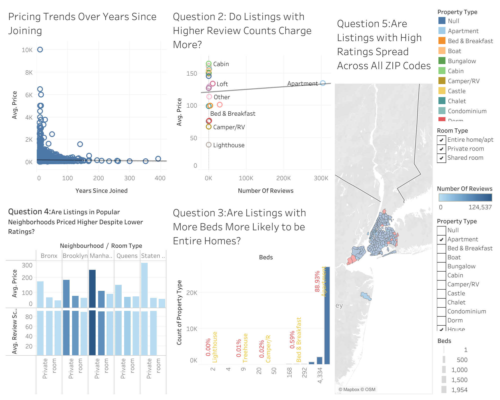
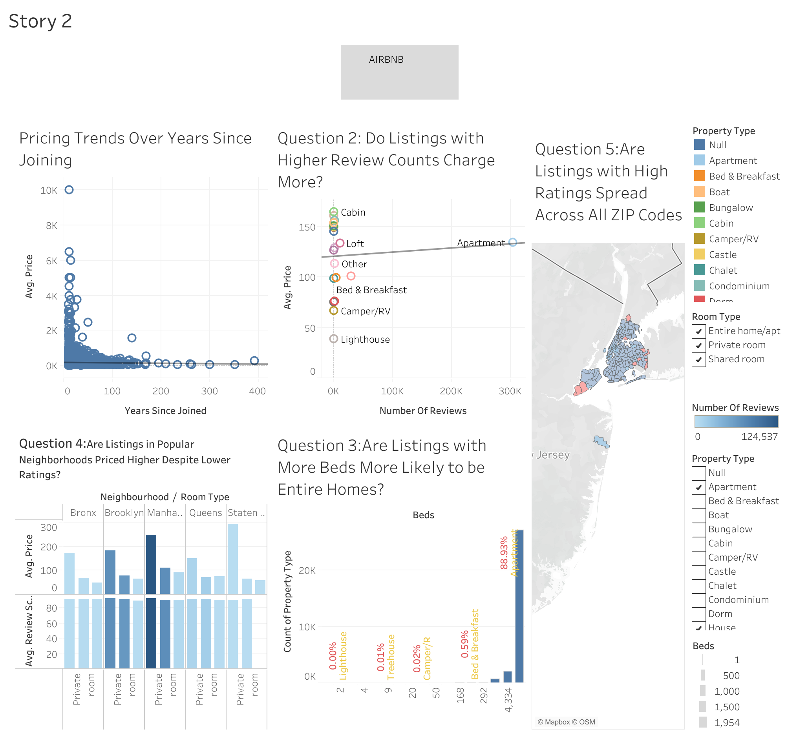

# 📊 Airbnb NYC Tableau Analysis

This repository contains my final project for Data Visualization using **Tableau**, where I analyzed Airbnb listings in New York City to extract insights related to pricing, demand, reviews, and property types.

---

## 🔗 Tableau Visualizations
- 📈 **Interactive Dashboard**: [View on Tableau Public](https://public.tableau.com/views/Airbnb_17331837714330/Dashboard1)
- 📖 **Story Presentation**: [View Story](https://public.tableau.com/views/Airbnb_17331837714330/Story2)

---

## 📄 Final Report
📥 Download the complete write-up: [Airbnb_Tableau_Final_Project.docx](Airbnb_Tableau_Final_Project.docx)

---

## 📸 Screenshots

### 🧩 Dashboard Overview

### 📚 Story View

---

## 🔍 Key Insights

- 💡 Listings with **higher review counts** tend to charge more — showing trust increases perceived value.
- 📈 **Trend lines** reveal that prices have steadily increased over time — likely due to rising demand.
- 🏡 **Entire homes** dominate listings suitable for families and large groups.
- 📍 **Location matters**: Manhattan listings are priced high even with average ratings.

---

## 🛠️ Skills Demonstrated

- 🔍 Data Exploration & Insight Derivation
- 🎨 Data Storytelling with Tableau
- 📊 Dashboard & Story Design
- 📈 Trend Analysis and Interactive Filtering
- 📌 Presenting Business-Impactful Insights

---

## 🚀 How This Aligns with My Data Engineering Path

Although Tableau is primarily a BI tool, this project strengthens my understanding of:
- Data sourcing and preparation
- Analytical thinking
- Presenting meaningful insights from real-world datasets  
These are foundational skills that I will continue to build upon as I pursue data engineering through tools like **SQL, Python, Airflow, and Spark**.

